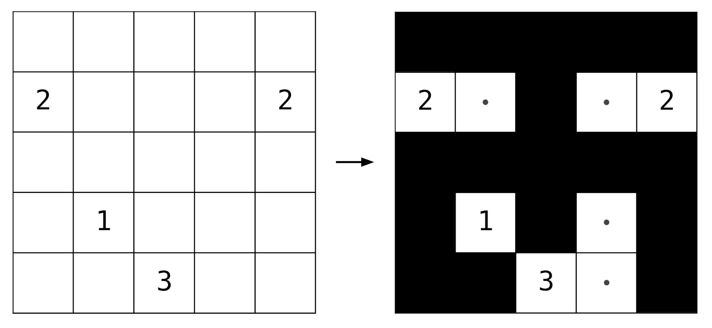

# NUrikaBE Solver (NUBE)
Authors: Simon Kim, Ji Hun Wang

Using different techniques in RL to solve [Nurikabe](https://en.wikipedia.org/wiki/Nurikabe_(puzzle)), a NP-complete binary logic puzzle.

Currently implemented MCTS, AlphaNurikabe (AlphaGo variant for Nurikabe) and Decision Transformer. Check each directory for more detail.



## Data 
Dataset is publicly available [in this drive](https://drive.google.com/drive/folders/1sYMgK5gEobvXhwXw8rZRuJuXeImitsrV?usp=sharing). Within `grids/`, there are two puzzles scraped from logicgamesonline and janko, respectively. The former consists of 9x9 grids. The latter consists of variable size grids ranging from hard to extremely hard. 

`trajectories_train.zip` and `trajectories_val.zip` are available as well, which is used for Decision Transformer results. These are results of running the Microsoft solver on logicgamesonline puzzles. 120 trajectories were generated for each puzzle by permuting the heuristic order, i.e. 

```cpp
test_fn *analysis_functions = new test_fn[5]; 

analysis_functions[0] = &Grid::analyze_complete_islands;
analysis_functions[1] = &Grid::analyze_single_liberties;
analysis_functions[2] = &Grid::analyze_dual_liberties; 
analysis_functions[3] = &Grid::analyze_unreachable_cells; 
analysis_functions[4] = &Grid::analyze_potential_pools; 

for (int i = 0; i < 5; i++) {
    if ((this->*(analysis_functions[order[i]]))(verbose, cache)) {
        return m_sitrep; 
    }
}

```

Dataset size: 
```
Training set: 671290 Trajectories (5335 Grids)
Evaluation set: 167866 Trajectories (1334 Grids)
```

Look at `dt/README.md` for more information about the trajectory.
## Directory
```
.
├── dt/                     # Decision Transformer    
├── Nurikabe/                    
│   ├── alpha_nurikabe/     # AlphaNurikabe
│   ├── mcts/               # MCTS Nurikabe          
├── solvers/                # Non-ML Solver                
```