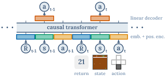

# Nurikabe Decision Transformer
Authors: Simon Kim, Ji Hun Wang

Decision Transformer Solver for Nurikabe. Code, diagram, and explanation adapted from the [original Decision Transformer paper](https://arxiv.org/abs/2106.01345)



## Trajectory Data 
Dataset is publicly available [in this drive](https://drive.google.com/drive/folders/1sYMgK5gEobvXhwXw8rZRuJuXeImitsrV?usp=sharing). Once unzipped, each trajectory data [train, val] is structured as follows:
```
trajectories_train
├── 00001/                     # Grid 1   
│   ├── 00000.csv              # Grid 1, Trajectory 1
│   ├── ...
│   ├── soln.npy               # Grid 1, Solution          
├── 00002/                     # Grid 2                
```
About 5% of trajectories are "faulty", i.e. the solver steps on a numbered cell and the game terminates immediately. All such trajectories
have a id >= 120. 

Each trajectory is represented as a `.csv` file. An example trajectory file:
```
2,2                 # 2x2 grid
-2,-2,-2,1          # flattened state at t = 1
-2,-2,-1,1          # t = 2
-2,-1,-1,1          # t = 3
-1,-1,-1,1          # t = 4
4,81 milliseconds   # num solved, time
```
Use functions in `data/data_utils.py` to interact with trajectory files.

## Training
```console
$ python3 train.py --yaml=config.yaml
```
You can modify fields in the config using CLI, e.g.
```bash
# using delayed reward scheme
$ python3 train.py --yaml=config.yaml --model.reward_type='delayed' 